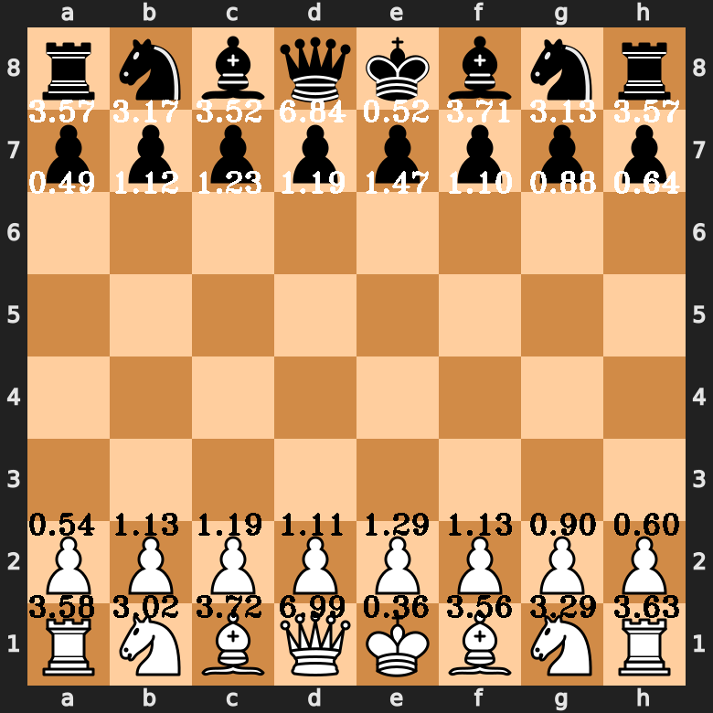

# chess-and-eigenvectors

This figure shows the results of a calculation to find the 'fighting strength' or 'influence over material' of each chess piece ***in their starting positions, at the beginning of the game***. A discussion of the peculiarities revealed by this approach follows a brief summary of other efforts to solve this question.




## A Description of the Problem


Much has been written about the relative strength of the chess pieces. Hundreds of articles can be found stretching back many years. The heuristic still commonly used today: pawns worth 1, bishops and knights worth 3, rooks worth 5, and queens worth 9, has been in use since at least 1942 [7,8].


Researchers at DeepMind have performed analyses of the oevre of games played by AlphaZero, their chess playing system. Their estimations of relative piece value are noted here:

```
In Classical chess, piece values vary based on positional
considerations and game stage.[...] bishops are typically considered to be more
valuable than the knights, and there is usually an additive
adjustment while in possession of a bishop pair. The rook
value varies between 4.5 and 5.5 depending on the system
and the queen values span from 8.5 to 10. The relative
piece values estimated on the AlphaZero game sample for
Classical chess, 3.05–3.33–5.63–9.5, do not deviate much
from the existing systems. [2]
```
These values are amazingly close to an 1847 heuristic: 3.05-3.50-5.48-9.94. [6,7]

Many other approximations exist, most of which fail in some respect. The reason is that it's hard to encapsulate how the dynamics of the game work into a simple quantitative system. Different approaches will also have differing pros and cons.
The obvious advantage of the basic heuristic is it's simplicity. It can be taught to anyone, of any level of play, and remembered without effort. Some of the other approximations have other advantages. Space averaging calculations have the advantage of objectivity, and also representing one critical aspect of how players conceive of the game: the possibility of movement. Players are constantly considering where to move their pieces. Pieces that can move further clearly have more opportunities for attack and defense, because they can reach more squares. So this calculation captures something about the true value of each piece. The objectivity of the approach is apparent in another detail of it's outcome, the ratios. The proportions of value between all the pieces are less clean than the standard heuristic, and this is a natural outcome.


One important historical approach to mention is from the 1889 book, "The Modern Chess Instructor" with ideas developed further in 1896's "Theory of Perfect Play" both by Wihelm Steinitz [4]. His approach accounts for another flaw of the standard heuristic, the weakness of the outside pawns. It is well known that the outside pawns are weaker than the center pawns, but the question is: by how much? Stieglitz qualitatively describes this advantage. 
```
The two Rook's pawns are the weakest, as each only commands one square,
while the others command two. [4]
```
Chess GM and writer Larry Kaufman performed a set of computational experiments, suggesting the the outside pawns are roughly 15% weaker. [5]


The concerns mentioned above lead to a logical conclusion, that the existing heuristics are all useful for different reasons, and all lacking in some respect. The over-simplicity of the standard heuristic is a problem for all but beginning players. It would be useful to know the true strength of each piece. 

The procedure described below gives an objective way of calculating the relative difference in strength between pieces, on their starting positions. In line with the historical approaches described above, there are a few expectations, or hypotheses, which are simple to state, arguing why certain characteristics of a heuristic make it innacurate. These hypotheses can also been seen as a minimum standard by which heuristics can be judged. It all depends on what information you want to capture. 


The white pieces have an overall advantage over blacks pieces, due to the first move tempo advantage. We might expect the sum of the values of all of white pieces to be slightly higher than the sum of all of black's pieces.

It is natural to expect that any calculation of the relative strengths of the chess pieces will probably not conform to simple fractions of small integers. That is, one can expect the results of any such calculation
to extend to some arbitrary number of decimal digits. This issue has been described well by Larry Kaufman:
```
an accurate table needs fractions, because it would be quite remarkable 
if the true values of such different types of pieces were all integer 
multiples of the pawn. The other reason is that the values of the pieces 
depend somewhat on what other pieces are on the board. [5]
```


The known difference in strength between the outside pawns and the central pawns should be reflected in the final result of the calculation.


The kingside and queenside versions of a major piece, on the same side of the board, are not equal in value. They are likely very close, but not identical in strength, for the same reasons that outside pawns are weaker,
they are weaker because of being constrained and innefective in their starting position, and nothing else. They can move the same as any other of the same piece type, it's their starting position that matters. Indeed, every piece should have a unique value. We don't expect any two pieces to have an indentical strength.


This implies one final caveat about understanding the results of the following procedure: they only apply to pieces ***in their starting positions, at the beginning of the game***. They don't show, on their face, positional strengths.
Once the game starts, and pieces start moving, their actual strength in that situation is not static. One way to think about this is sacrifice value. In the endgame, just because a pawn started out as a central pawn or an outside pawns doesn't make it more valuable anymore, the position has changed so much, and there are so few pieces on the board that it doesn't matter anymore, only the position matters. You wouldn't sacrifice a piece based on these values, because the position supercedes their theoretical value.

So if this procedure doesn't capture positional information what does it capture? It averages all of those positional advantages into a single number that for each piece that represents it's ***capturing ability, relative to other pieces***.
This approach takes as an axiom that capturing pieces,over many games, is what demonstrates a pieces relative strength.
The entire game is advanced by capturing pieces, until the King too is inevitably trapped and captured. So these numbers also represent each piece's ***'influence' over the game, from their starting positions***.
For example, what exactly is the underlying reason why a queen should be worth so much? Is it because it can move around the board better than other pieces? Yes, but the real effect of that is that it can capture many more pieces than
say, a pawn. There is nothing preventing a pawn from capturing many pieces in any given game, even a piece of high value. But averaged over many, many games, the pawns will not be capturing nearly as many pieces as the stronger
pieces are capturing, and weaker pieces will, on average, capture pieces with lower strengths. So, we need an approach that can balance these relationships, and distill them into a single number for each piece.


## The Procedure


Let's consider a simplified version of the procedure to start.
Simply tally up the number of captures for each piece on the board, over a large number of games. That's it!
If you overlay these numbers on a chess board you will see that the queens captured more pieces than any other pieces. The major pieces captured more than any of the pawns. And the central pawns will have more captures than the outside pawns.
Even this simple tally shows some of the aspects of our hypotheses.
But this is not how we normally think of chess values. Usually a pawn is equal to one. To scale down our values to the point where a pawn is equal to one, we need to normalize our values.
That means we divide every value on the board by the same number, keeping all the proportions the same, but lowering the absolute numbers to a point where they're easy to make sense of.
We can normalize to any value, and normalizing to certain pieces on the board will make certain information more obvious. For instance, normalizing to the strongest piece on the board, would assign the value of 1 to the white queen, and every other piece would be interpretable as a 'percentage' of her strength.
For now, let's normalize to the value of the average pawn. That way, when we see the proportional values of the major pieces, they will be on the same scale as all the historical heuristics (in which pawns are worth 1), and we can compare them.
After the values are normalized, the average of all the pawns is 1, but their values are either above or below 1, depending on their position. These numbers are not simple fractions of integers, as expected.
Even this simple tallying procedure has results that confirm some of our suspicions.
But there is an obvious problem, the proportions of the pieces are not correct.
A simple tally considers all captures to be the same, but capturing stronger pieces is more significant, and a simple tally doesn't register that.
Stronger pieces tend to capture stronger pieces, on average.


So how can we calculate the tally, while accounting for all the strengths of the pieces that were captured?
We need weights for each piece, so that when a strong piece is captured, the capturing piece has it's tally increased ***proportionally*** to the strength of the piece that it captured.
So when a piece captures another piece, it gets the weight of the captured piece addded to it's tally.
But how can we know what the weights are?
When we try to go do the tally, we have no idea what weights to use, since we haven't calculated them yet.
If you want to tally a capture, it adds value to the weight of the capturing piece, and then you have to reconsider all the other times that that piece was captured, changing all the values of all the other pieces.
What to do?
This problem is exemplified by an epigram from philosopher Georg Simmel about the nature of balancing interconnected relationships, which begins Christian Hesse's wonderful article on the relative strength of the pieces. [9]

```
Thus it appears that there is a reciprocal determination of value by the objects. 
By being exchanged, each object acquires a practical realization and 
measure of its value through the other object.
G. Simmel : Die Philosophie des Geldes 
(tr. by Tom Bottomore and David Frisby) [3]
```

This perfectly encapsulates the tallying problem we just described, and shows a keyhole into how this problem can be solved.
Liner Algebra!
The structure of this problem is perfectly suited for obtaining a solution with linear algebra.
The interlocking connections in our weighted tallying system, where each change of a single value changes every other value, is, in fact, an Homogeneous System of Linear Equations. 
It is a list of 32 equations, one for each of the pieces. On the left side of each equation is a variable representing the weight of each individual chess piece.
On the right side of each equation is the sum of all of that piece's captures, 16 terms, one for each of the opposing pieces that it could capture (a side can't capture it's own pieces),
where each capture is multuplied by the weight of the piece captured. 
The beauty of linear algebra is that it can solve all the equations at once, bypassing the shifting weights issue.
Every homogeneous system of linear equations has at least one solution, the zero vector. But that has no interest for us, it doesn't contain useful information.
Each eigenvector is a non-trivial solution. In our case, all eigenvectors except one contain imaginary values.
Let's choose the largest real-valued eigenvector, and take it's entries as solutions to each equation.
These are the relative strengths of each chess piece.

# Conclusion
The results of the calculation described above, and performed in the attached python notebook, reveal some expected characteristics, and some unexpected ones. Here we will speculate as to the underlying reasons for these results.

Most noticeably, the rooks seem undervalued by this approach. This is somewhat rational if you consider that our approach favors the beginning of the game, not the endgame, when rooks are far more important. As noted above, the values of pieces change based on their positions. At the start of the game, rooks are essentially unused. Another aspect affecting the rooks in particular may be the inclusion of a bias for checkmating, or winning, in other systems. This calculation is indifferent to the game outcome, and checkmating, except insofar as it represents a capture. Rooks are very often involved in the endgame and checkmating, which raises their intuitive value. What this calculation is saying is that Rooks don't actually capture that much more material, but they probably have a huge positional influence that is not reflected in their capturing statistics.

Another unpredicted outcome is the lack of any tempo advantage discernible in the sum of each sides pieces. It was expected that we would see a slight advantage for white in it's piece totals. But the difference is tiny, negligable, why is that? It seems related to the problem of the low rook value, in that ***white's tempo advantage may translate directly into positional advantages, rather than material advantages***, in which case they wouldn't show up in this kind of calculation, which focuses only on material. This brings us to another interesting result.

Black's pawns are somewhat stronger than white's pawns, both individually, and summed. Why should this be? One possible reason is the way that openings commonly play out. At the beginning of the game, white has a significant tempo advantage, and usually uses this to develop major pieces quickly, and push pawns to the center as soon as possible. Black is immediately on the defensive, which can equalize as the game progresses, but initially, blacks pawns are more costrained, in terms of capturing the center. This means that white's initial push forward is vulnerable to attack, and black's pawns are almost always involved in the first few exchanges, meaning that white's initial positional advantage is balanced by a defensive advantage from black, allowing for outsized captures towards the very beginning of the game, which is the time that our calculation is most sensitive to.

Addressing the outside pawns, we see that they are drastically weaker than the inside pawns, even the b and g file pawns. The a and h file pawns are roughly %50 weaker than an average pawn. The four central pawns are each over %33 stronger than average. The difference noted here is much greater than other estimations, but still satisfies the underlying logic.

Finally, the fighting strength of the king is one calculation that is not always easy to make, or even possible, depending on the method. It is interesting to see that the actual fighting strength of the king is around that of the average pawn. The white king also seems more reluctant to enter battle than the black king.

The database of games used for the calculation also may have some effect on the balance of ratios, since strong players make use of pieces differently (and better) than amateur players. Obtaining a higher quality dataset of games may change the outcome.

## References

[1] Capablanca, J. and de Firmian, N. Chess Fundamentals:
Completely Revised and Updated for the 21st Century.
Chess Series. Random House Puzzles & Games, 2006.

[2] Tomašev, Nenad, Ulrich Paquet, Demis Hassabis and Vladimir Kramnik. “Assessing Game Balance with AlphaZero: Exploring Alternative Rule Sets in Chess.” ArXiv abs/2009.04374 (2020).

[3] Christian Hesse. The Joys of Chess. Continental Sales, Inc., 2011.


[4] Wilhelm Steinitz. The Modern Chess Instructor. Russell enterprises Incorporated. 1889 reprinted 2017. 

[5] Larry Kaufman. The Evaluation of Material Imbalances. Chess Life, March 1999.

[6] Howard Staunton. The Chess-Player’s Handbook. London, 1847. Page 34.

[7] Edward Winter. The Value of the Chess Pieces. https://www.chesshistory.com/winter/extra/value.html 2022.

[8]  Reuben Fine. Chess The Easy Way. 1942. Page 23.

[9] Christian Hesse. "The Joys of Chess and the Value of the Pieces." https://en.chessbase.com/post/the-joys-of-che-and-the-value-of-the-pieces/9, visited 2022.


